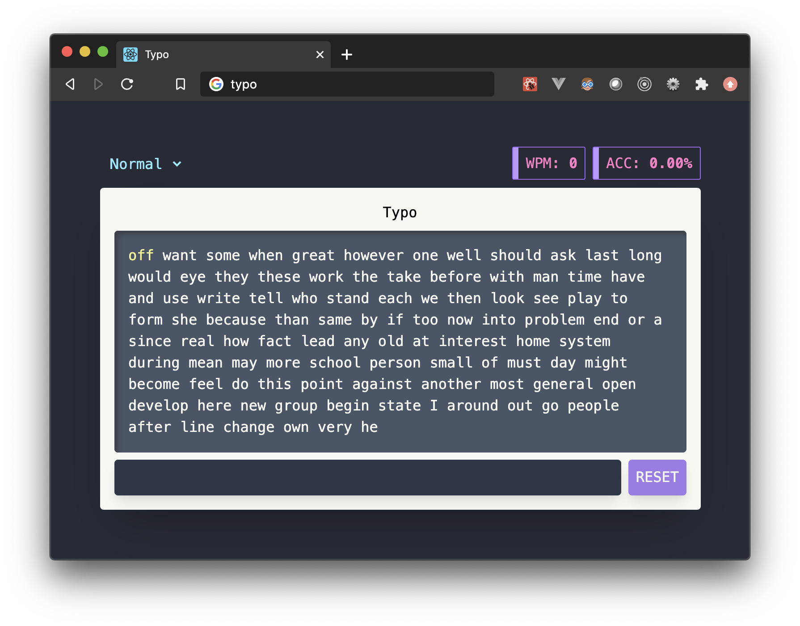

# Project Typo
A tiny project to play around with React, Typescript, TailwindCSS & Cypress  
100% inspired by **briano1905**'s [typings.gg](https://typings.gg/)

## Automated Testing (+ visual demo) with Cypress
1. Run `yarn install` to download project dependencies
2. Run `yarn start` to launch the application in dev mode at http://localhost:3000
3. Run `yarn cypress` to launch the Cypress test runner
4. After the Cypress window launches, click on `typing_test_spec.js`
   > Chrome will start up and be controlled by Cypress to run the UI test suite

Learn more about Cypress [here](https://www.cypress.io/)!
